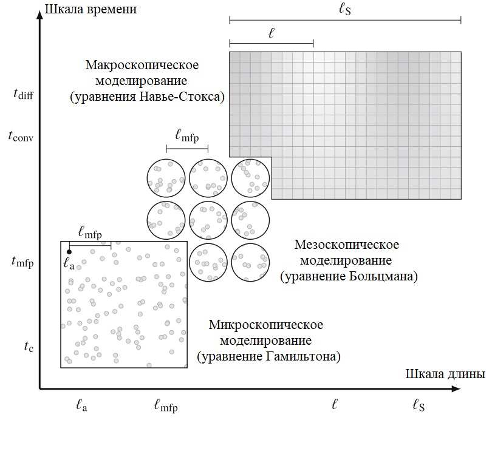
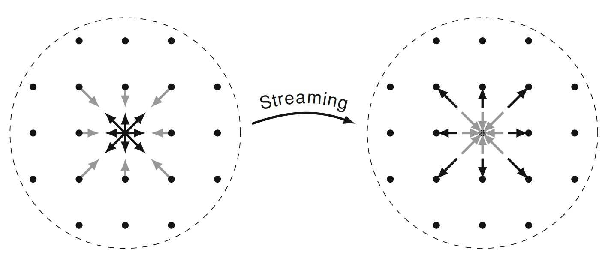
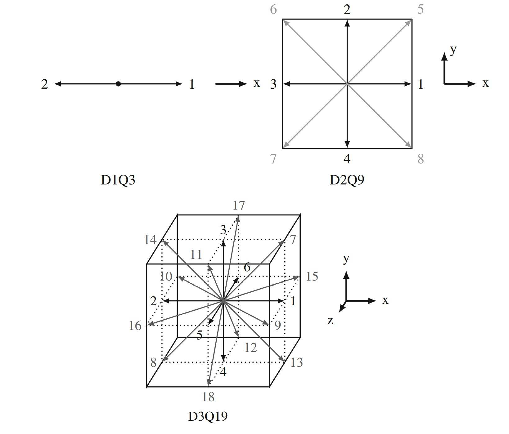
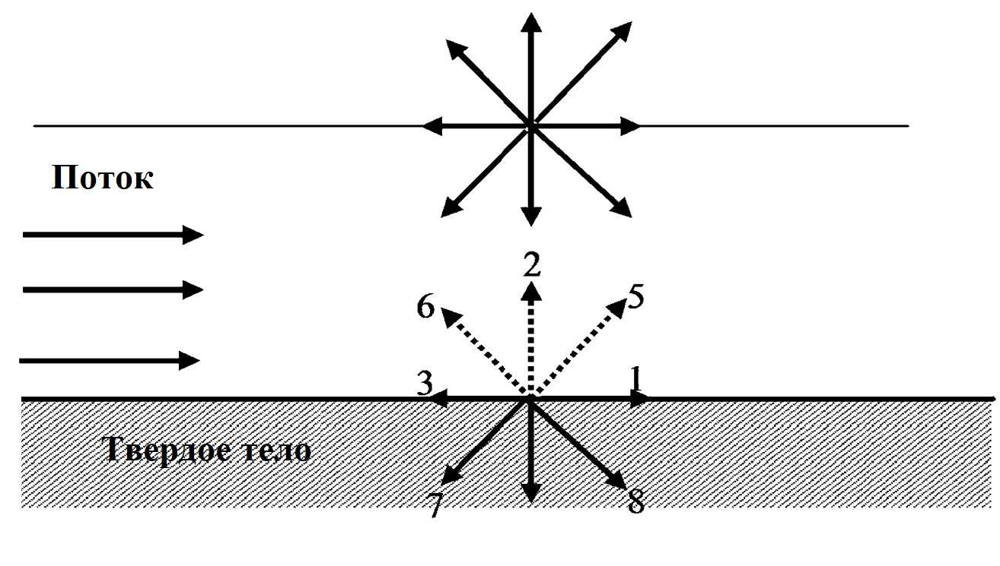
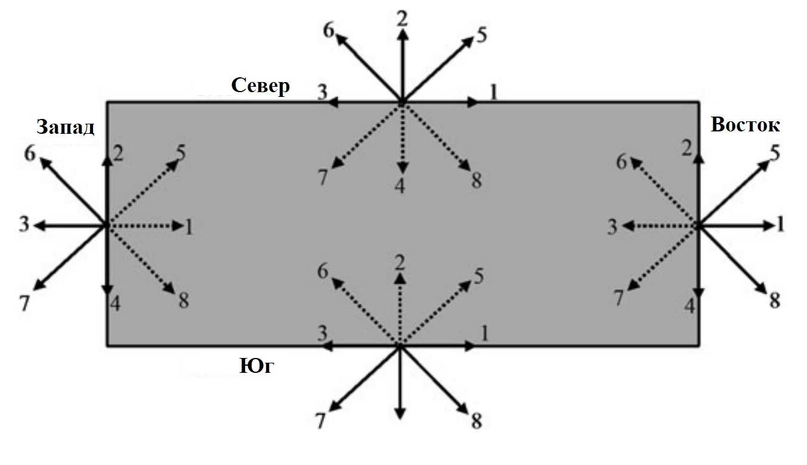
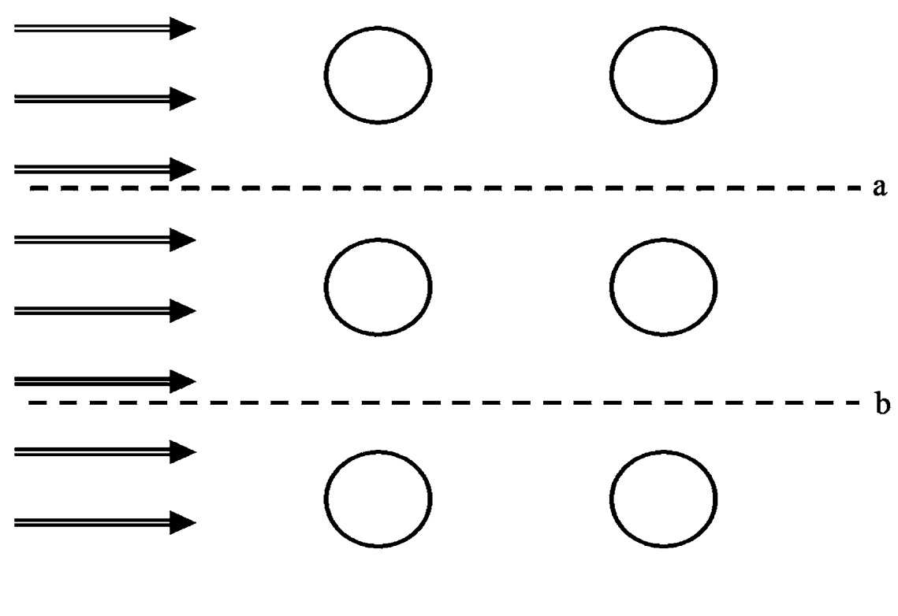
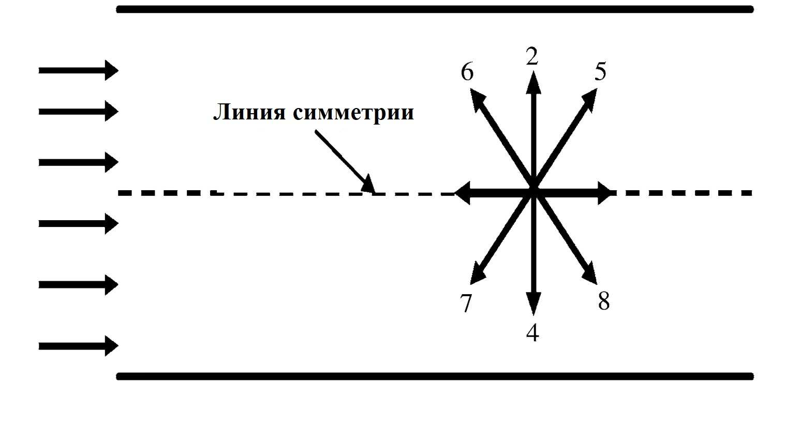

# 4 Метод решеточных уравнений Больцмана

## 4.1 Введение

Традиционно для решения задач гидродинамики применяются вычислительные методы, основанные на численном решении уравнений Навье-Стокса. Однако в последние 30 лет развивается альтернативный подход – метод решеточных уравнений Больцмана (Lattice Boltzmann method или LBM), в котором для моделирования течения вязкой Ньютоновской жидкости решается дискретизированное уравнение Больцмана.

### 4.1.1 История метода

Интерес к решетчатому методу Больцмана неуклонно растет с тех пор, как он вырос из моделей решетчатого газа в конце 1980-х годов [30]-[33]. Модели решетчатого газа были впервые представлены в 1973 году Харди, Помо и де Паццисом как чрезвычайно простая модель двумерной газовой динамики [34]. Их конкретная модель впоследствии была названа HPP моделью в честь ее изобретателей. В этой модели фиктивные частицы существуют на квадратной решетке, где они движутся вперед и сталкиваются таким образом, чтобы соблюдалось сохранение массы и импульса, во многом так же, как молекулы в реальном газе. Поскольку решетка HPP была квадратной, у каждого узла было четыре соседа, и каждая частица имела одну из четырех возможных скоростей $c_i$, которые привели бы частицу к соседнему узлу за один временной шаг.

Однако только в 1986 году Фриш, Хасслахер и Помо опубликовали модель решетчатого газа, которую фактически можно было использовать для моделирования жидкости [35]. Их модель также была названа в честь ее изобретателей как модель FHP. Разница с оригинальной моделью HPP небольшая, но значительная: вместо квадратной решетки и четырех скоростей модели HPP модель FHP имела треугольную решетку и шесть скоростей $c_i$. Это изменение, как оказалось, дало модели достаточную изотропию решетки для выполнения моделирования жидкости [36]-[38].

Вышеупомянутые модели имеют ряд существенных недостатков, в частности проблемы статистического шума, поэтому в конце 1980-х годов появляется решетчатый метод Больцмана [31]-[33], который избавляется от них, сохраняя при этом свои сильные стороны. Это был оригинальный метод получения LBM, и до середины 90-х годов не было полностью понято, как его вывести из кинетической теории газов [39]. Сейчас он имеет более прочное теоретическое обоснование в физической теории газов.

### 4.1.2 О разных уровнях подхода описания жидкости

Рассмотрим жидкость в рамках картины классической механики (от малого до большого). У нас есть размер атома жидкости или молекулы $l_a$, средний свободный путь (расстояние, пройденное между двумя последовательными столкновениями) $l_{mfp}$, типичный масштаб для градиентов в некоторых макроскопических свойствах $l$ и размер системы $l_s$. Типичный порядок этих шкал длины составляет $l_a \ll l_{mfp} \ll l \le l_s$, как показано на рисунке 4.1.



_Рисунок 4.1 – Иерархия масштабов длины и времени в типичных задачах гидродинамики_

В контексте жидкостей часто ссылаются на микроскопические, мезоскопические и макроскопические описания, как показано на рисунке 4.1. Под «микроскопическим» понимается молекулярное описание, а под «макроскопическим» – полностью непрерывная картина течения с осязаемыми величинами, такими как скорость и плотность жидкости. Таким образом, микроскопические системы управляются динамикой Ньютона, в то время как уравнения Навье-Стокса являются управляющими уравнениями для сплошной среды. Однако между микроскопическим и макроскопическим описанием находится «мезоскопическое» описание, в котором не отслеживаются отдельные молекулы. Скорее, при данном описании отслеживается распределение или репрезентативные коллекции молекул. Кинетическая теория является мезоскопическим описанием жидкости.

Для решения уравнений Навье-Стокса обычно используются метод конечных разностей (FDM), метод конечных объемов (FVM) или метод конечных элементов (FEM). Однако, данные методы можно использовать только для моделирования процессов макроуровня, так как в их основе лежат уравнения Навье-Стокса.

Для моделирования процессов микроуровня используют метод моделирования молекулярной динамики (MD). В нем определяются межчастичные (межмолекулярные) силы и решается обыкновенное дифференциальное уравнение второго закона Ньютона (сохранение импульса). На каждом временном шаге определяется местоположение и скорость каждой частицы, то есть траектория частиц. Однако, данный метод плохо подходит для моделирования мезоскопических процессов и совсем не подходит для макроскопических процессов, так необходимо будет промоделировать движения слишком большого количества молекул (в 1 мм³ воздуха содержится $2.5 \cdot 10^{16}$ молекул при комнатных условиях).

Для описания процессов мезоуровня используют уравнение Больцмана. Основная идея состоит в том, чтобы преодолеть разрыв между микромасштабом и макромасштабом, рассматривая не поведение каждой частицы в отдельности, а поведение совокупности частиц как единого целого. Свойство совокупности частиц представлено функцией распределения, которое действует как средство представления для сбора частиц. Один из численных методов, который использует уравнение Больцмана, является метод решеточных уравнений Больцмана. Этот метод, по сравнению с вышеописанными, идеально подходит как для моделирования мезопроцессов, так и макропроцессов, что дает ему существенное преимущество относительно других методов. Другие преимущества, а также недостатки данного метода будут более подробно обсуждены в следующем подпункте.

### 4.1.3 Преимущества и недостатки

В ряде публикаций сравнивается LBM с другими методами (например, [36], [40]-[43]). Из этих сравнений в книге [30] были сделаны некоторые выводы о преимуществах (+) и недостатках LBM (−) для ряда тем:

- **Простота и эффективность**
  - (+) Для решения несжимаемого уравнения Навье-Стокса LBM аналогичен псевдосжимаемым методам, которые обеспечивают простоту и масштабируемость за счет обеспечения искусственной сжимаемости [40].
  - (+) Как и псевдосжимаемые методы, LBM не включает уравнение Пуассона [40], которое может быть трудно решить из-за его нелокальности.
  - (+) Самые тяжелые вычисления в LBM являются локальными, т.е. ограничены узлами, что еще больше повышает его способность к распараллеливанию [36].
  - (−) LBM требует много памяти. Для распространения популяций требуется большое количество событий доступа к памяти. Это основное узкое место в вычислениях LB.
  - (−) LBM, будучи по своей сути зависящим от времени, не особенно эффективен для моделирования стационарных течений [41].
- **Геометрия**
  - (+) LBM хорошо подходит для моделирования потоков с сохранением массы в сложных геометриях, таких как пористые среды [36], [40], [43].
  - (+) Перемещение границ, которые сохраняют массу, может быть особенно хорошо реализовано в LBM [40], что делает его привлекательным методом для моделирования мягких веществ [43].
- **Многофазные и многокомпонентные потоки**
  - (+) Существует широкий спектр многофазных и многокомпонентных методов, доступных для LBM [40].
  - (+) В сочетании с преимуществами LBM в сложных геометриях это означает, что он хорошо подходит для моделирования многофазных и многокомпонентных потоков в сложных геометриях [36].
  - (−) Как и в других методах на основе решетки, вблизи границ раздела жидкость-жидкость возникают паразитные течения.
  - (−) Согласно [40], никакие многофазные или многокомпонентные методы для LBM не смогли хорошо использовать его кинетическое происхождение, что означает, что эти методы не сильно отличаются от методов обычного CFD.
  - (−) Диапазон вязкостей и плотностей несколько ограничен при многофазном и многокомпонентном моделировании [40].
- **Тепловые эффекты**
  - (+) Тепловые колебания, которые возникают в микромасштабе, но усредняются на макроуровне, могут быть включены в LBM мезоскопически. Примеры применения к идеальным системам [44]-[46] и к неидеальным системам [47], [48] с тепловыми флуктуациями.
  - (−) Энергосберегающее (тепловое) моделирование не является простым в LBM [36], [40].
- **Звук и сжимаемость**
  - (+) Поскольку LBM является (слабо) сжимаемым решателем Навье-Стокса, он может хорошо подходить для моделирования ситуаций, в которых звук и поток взаимодействуют, таких как аэроакустическая генерация звука [49].
  - (−) LBM не подходит для прямого моделирования распространения звука на большие расстояния при реалистичных вязкостях [40], [49].
  - (−) LBM может не подходить для моделирования сильно сжимаемых (т.е. трансзвуковых и сверхзвуковых) потоков [36], [40].
- **Другие пункты**
  - (+) LBM подходит для моделирования мезоскопической физики, которую трудно описать макроскопически [36].

В LBM наиболее распространенной формой дискретизации пространства является однородная и структурированная сетка. Хотя на неструктурированных сетках существуют дискретизации LBM [50], [51], и возможно локальное уточнение сетки LBM на структурированных сетках [52].

В настоящее время LBM достиг высокого уровня развития, и его возможности для ряда задач сопоставимы с возможностями традиционных методов решения уравнений Навье-Стокса. Созданы как коммерческие (PowerFLOW, XFlow), так и свободно распространяемые (Palabos) пакеты программ для расчета задач вычислительной гидродинамики, основанные на LBM.

## 4.2 Моделирование несжимаемого изотермического течения

Кинетическое уравнение Больцмана для одночастичной функции распределения $f(\vec r, \vec\xi, t)$ без учета внешних сил имеет вид:

```math
\frac{\partial f}{\partial t} + \vec\xi \nabla f = \Omega, \tag{4.1}
```

где $\Omega$ – интеграл столкновений; $t$ – время; $\vec r = (x, y, z)$ – вектор пространственных переменных; $\vec\xi = (\xi_x, \xi_y, \xi_z)$ – вектор скорости частицы.

Макроскопические характеристики плотность $\rho(\vec r, t)$ и скорость среды $\vec u(\vec r, t)$ являются моментами функции распределения и находятся посредством интегрирования по всем возможным скоростям $\vec\xi$.

Дискретизация уравнения 4.1 производится в два этапа: на первом этапе осуществляется дискретизация в пространстве скоростей, а на втором этапе – дискретизация по времени и пространственным переменным. Для дискретизации в пространстве скоростей задается конечная совокупность векторов возможных скоростей $\lbrace \vec e_k \rbrace_{k=1}^{M}$, каждому вектору из заданной совокупности ставится в соответствие функция распределения, зависящая только от $t$ и $\vec r$: $f_k(\vec r, t) = f(\vec r, \vec e_k, t),\ k = \overline{1, M}$. Таким образом, уравнение 4.1 сводится к системе уравнений в частных производных относительно $f_k$, которые называются уравнения Больцмана с дискретными скоростями:

```math
\frac{\partial f_k}{\partial t} + \vec e_k \nabla f_k = \Omega_k. \tag{4.2}
```

Из этого уравнения, рассматривая равномерную по времени и по пространственным переменным сетку и предполагая, что частицы за шаг по времени перелетают в соседние узлы пространственной решетки (т. е. размер ячейки $\Delta\vec r_k = \vec e_k \Delta t$), может быть получено решеточное уравнение Больцмана:

```math
f_k(\vec r + \vec e_k \Delta t, t + \Delta t) = f_k(\vec r, t) + \Delta t\, \Omega_k(f_k(\vec r, t)). \tag{4.3}
```

Более подробное получение решеточного уравнения Больцмана из 4.2 изложено в [38].

В методах LBM оператор столкновения обычно используется в виде BGK (Bhatnagar-Gross-Krook) приближения, которое представляет собой линейную релаксацию к локальному равновесию:

```math
\Omega_k = \left(f_k^{eq}(\vec r, t) - f_k\right) / \tau,
```

где $\tau$ (от 0.5 до 2) – безразмерный параметр релаксации, а $f_k^{eq}$ – равновесная функция распределения, имеющая вид:

```math
f_k^{eq}(\vec r, t) = w_k \rho(\vec r) \left(1 + \frac{(\vec e_k \cdot \vec u)}{c_s^2} + \frac{(\vec e_k \cdot \vec u)^2}{2 c_s^4} - \frac{\vec u^2}{2 c_s^2}\right). \tag{4.4}
```

Здесь $c_s$ – базовая скорость в ячейке ($c_s = 1/\sqrt{3} \cdot \Delta x / \Delta t$), а $w_k$ – весовые коэффициенты, различные для разных моделей решеток и подбираются так, чтобы при применении к уравнению 4.2 процедуры разложения Чепмена-Энскога получались уравнения Навье-Стокса [53].

Такой вид $f_k^{eq}$ представляет собой разложение равновесной функции распределения Максвелла по скоростям $\vec u$ до членов третьего порядка малости.

Плотность жидкости $\rho$ и скорость $u$ в узле могут быть вычислены в соответствии с формулами:

```math
\rho = \sum_{k=0}^{M} f_k, \qquad \rho \vec u = \sum_{k=0}^{M} f_k \vec e_k \tag{4.5}
```

Решаемое дискретное уравнение 4.3 и функцию распределения 4.4 раскладывают в ряд по степеням малого параметра – шага по времени. Используя только первые два члена разложения уравнения, можно получить уравнение для гидродинамических величин. Оно отличается от уравнений Навье-Стокса для несжимаемой жидкости на величину второго порядка по шагу по времени, а также на величину второго порядка малости по параметру, который в терминах этого метода исторически принято называть числом Маха $M$, хотя по смыслу он является числом Куранта. Этот параметр $M$ рассчитывается по формуле:

```math
M = \frac{u}{c_s}, \tag{4.6}
```

где $u$ – масштаб скорости задачи, а $c_s$ – уже упоминавшаяся базовая скорость. Согласно [54], параметр $M$ должен быть не более 0.1. При необходимости параметр $M$ можно уменьшить либо измельчив сетку, либо уменьшив параметр релаксации, однако это может привести к неустойчивости (в соответствии с [54], самым «безопасным» значением является значение $\tau = 1$, соответствующее максимальному значению $M$).

Кинематическая вязкость жидкости определяется через параметр релаксации, размер сетки и временной шаг:

```math
\nu = c_s^2 \left(\tau - \frac{\Delta t}{2}\right). \tag{4.7}
```

### 4.2.1 Шаг по времени: столкновения и перенос

В полном виде уравнение LBM с оператором столкновения BGK выглядит следующим образом:

```math
\underbrace{f_k(\vec r + \vec e_k \Delta t, t + \Delta t) = f_k(\vec r, t)}_{\text{перенос}}
\underbrace{- \frac{\Delta t}{\tau}\left(f_k(\vec r, t) - f_k^{eq}(\vec r, t)\right)}_{\text{столкновения}}. \tag{4.8}
```

Можно разложить это уравнение на две отдельные части, которые выполняются последовательно:

1. Первая часть отвечает за столкновения (или релаксацию),

   ```math
   f_k(\vec r, t + \Delta t) = f_k(\vec r, t) - \frac{\Delta t}{\tau}\left(f_k(\vec r, t) - f_k^{eq}(\vec r, t)\right), \tag{4.9}
   ```

   где $f_k(\vec r, t + \Delta t)$ представляет функцию распределения после столкновения, а $f_k^{eq}$ находится с помощью переменной $f_k$ через уравнение 4.4.

2. Вторая часть отвечает за перенос частиц,

   ```math
   f_k(\vec r + \vec e_k \Delta t, t + \Delta t) = f_k(\vec r, t + \Delta t), \tag{4.10}
   ```

Данное разложение продемонстрировано на рисунке 4.2, где черные одни частицы (черные), поступающие из центрального узла к его соседям, из которых другие частицы (серые) возвращаются обратно. Слева видно распределение $f_k(\vec r, t + \Delta t)$ после столкновений перед переносом частиц, а справа видно распределение $f_k$ до столкновений после переноса частиц.



_Рисунок 4.2 – Перенос функций распределения за шаг времени_

### 4.2.2 Пространственные решетки

В LBM под решеткой (lattice) понимается набор разрешенных векторов скорости (одинаковый для каждого пространственного узла). Для описания модели решетки в зависимости от размерности задачи и от набора возможных скоростей вводится обозначение вида DpQn, где $p \in \lbrace 1, 2, 3 \rbrace$ – размерность физического пространства, а $n \in \mathbb{N}$ – число возможных скоростей. Любая решетка должна содержать нулевой вектор из узла в себя самого – он описывает частицы, которые никуда не летят из данного узла.

Очевидными факторами для выбора решеток являются: точность моделирования (интуитивно понятно, что чем больше векторов в решетке, тем точнее моделирование), вычислительные затраты (расчет на решетке D2Q5 будет быстрее расчета на D2Q9). Наиболее распространенными моделями для задач гидродинамики являются для двумерной задачи девятискоростная модель D2Q9, а для трехмерной девятнадцатискоростная модель D3Q19.



_Рисунок 4.3 – Возможные вектора скорости частиц для моделей D1Q3, D2Q9, D3Q19_

Значения весовых коэффициентов для моделей D2Q9 (слева) и D3Q19 (справа):

```math
w_k =
\begin{cases}
\dfrac{4}{9}, & k = 0 \\[4pt]
\dfrac{1}{9}, & k = 1, 2, 3, 4 \\[4pt]
\dfrac{1}{36}, & k = 5, 6, 7, 8
\end{cases}
; \qquad
w_k =
\begin{cases}
\dfrac{1}{3}, & k = 0 \\[4pt]
\dfrac{1}{18}, & k = 1, 2, \ldots, 5, 6 \\[4pt]
\dfrac{1}{36}, & k = 7, 8, \ldots, 17, 18
\end{cases}
.
```

### 4.2.3 Граничные условия

Одним из важных и ключевых вопросов в LB-моделировании потока является точное моделирование граничных условий (ГУ). Задание граничных условий для уравнений Навье-Стокса в какой-то степени является простой задачей. Однако это не относится к LBM, где функции внутреннего распределения в области интегрирования должны быть определены на границах. Поэтому нам необходимо определить соответствующие уравнения для вычисления этих функций распределения на границах для данного граничного условия. В литературе предлагаются различные подходы для постановки ГУ. Рассмотрим основные граничные условия, которые являются с точки зрения автора книги [55] наиболее надежными и простыми.

#### Твердая стенка

Граничное условие твердой стенки (схема отскока) используется для моделирования твердого стационарного или движущегося граничного условия, условия отсутствия скольжения или обтекания препятствий. Метод довольно прост и в основном подразумевает, что входящая частица, приближающаяся к твердой границе, отскакивает обратно в область потока. В литературе [55] было предложено несколько вариантов данного ГУ. Одна из схем показана на рисунке 4.4. Решетки расположены непосредственно на твердой поверхности. Для данной схемы

```math
f_5 = f_7, \qquad f_2 = f_4, \qquad f_6 = f_8, \tag{4.11}
```

где $f_7$, $f_4$ и $f_8$ известны из процесса потоковой передачи. Некоторые авторы утверждают, что эта схема является первого порядка точности. Она является самой простой в реализации среди существующих, поэтому она и использовалась в данной работе.



_Рисунок 4.4 – Схема отскока_

Схема отскока может быть применена ко всем решеткам на твердых поверхностях при моделировании обтекания препятствия. Например, течение в пористой среде может быть смоделировано дискретными твердыми телами, внедренными в поток жидкости. Схему отскока следует использовать для узлов на твердых поверхностях и установить скорость в твердом теле и на нем равной нулю.

#### Граничные условия с известной скоростью

Очень часто в практических приложениях известна составляющая скорости на границе, например, скорость на входе для потока в канале. Чжу и Хе описали метод вычисления трех неизвестных функций распределения на основе уравнений 4.5 с предположением об условиях равновесия нормальных к границе.

Уравнения 4.5 могут быть записаны следующим образом

```math
\rho = f_0 + f_1 + f_2 + f_3 + f_4 + f_5 + f_6 + f_7 + f_8; \tag{4.12}
```

```math
\rho u = f_1 + f_5 + f_8 - f_6 - f_3 - f_7; \tag{4.13}
```

```math
\rho v = f_5 + f_2 + f_6 - f_7 - f_4 - f_8. \tag{4.14}
```

Имеется 4 неизвестных (три функции распределения и дополнительное неизвестное $\rho$ на границе). Однако имеется только три уравнения. Нужно построить другое уравнение или условие для нахождения решения. Это условие происходит из предположения о состоянии равновесия нормальном к поверхности.

Проиллюстрируем вышеизложенную концепцию на примере. На рисунке 4.5 показана область с западной, восточной, северной и южной границами. Компоненты скорости на этих границах известны.

На рисунке неизвестные функции распределения обозначены пунктирными линиями. Известные функции распределения после потоковой передачи обозначены сплошными линиями.



_Рисунок 4.5 – Функции распределения на границах области_

Для западных граничных условий x-компонента скорости ($u = u_W$) и y-компонента скорости ($v = v_W$) известны и имеют заданные значения, включая нуль (сплошная стенка). Тогда уравнение 4.12 можно записать следующим образом

```math
\rho_W = f_0 + f_1 + f_2 + f_3 + f_4 + f_5 + f_6 + f_7 + f_8. \tag{4.15}
```

Уравнение 4.13 можно записать как

```math
\rho_W u_W = f_1 + f_5 + f_8 - f_6 - f_3 - f_7. \tag{4.16}
```

Уравнение 4.14 можно записать как

```math
\rho_W v_W = f_5 + f_2 + f_6 - f_7 - f_4 - f_8. \tag{4.17}
```

Условие равновесия нормальное к границе дает

```math
f_1 - f_1^{eq} = f_3 - f_3^{eq}, \tag{4.18}
```

где $f^{eq}$ может быть вычислена из уравнения 4.4.

```math
f_1^{eq} = \frac{1}{9} \rho_W \left(1 + 3 u_W + \frac{9}{2} u_W^2 - \frac{3}{2}\left(u_W^2 + v_W^2\right)\right), \tag{4.19}
```

```math
f_3^{eq} = \frac{1}{9} \rho_W \left(1 - 3 u_W + \frac{9}{2} u_W^2 - \frac{3}{2}\left(u_W^2 + v_W^2\right)\right). \tag{4.20}
```

Подстановка приведенных выше уравнений в уравнение 4.18 дает

```math
f_1 = f_3 + \frac{2}{3} \rho_W u_W. \tag{4.21}
```

Для западной границы неизвестные функции распределения являются $f_1$, $f_5$ и $f_8$. Решая уравнения 4.15-4.21 для четырех неизвестных ($\rho_W, f_1, f_5, f_8$), дает следующие уравнения:

```math
\rho_W = \frac{1}{1 - u_W}\left(f_0 + f_2 + f_4 + 2(f_3 + f_6 + f_7)\right), \tag{4.22}
```

```math
f_5 = f_7 - \frac{1}{2}(f_2 - f_4) + \frac{1}{6} \rho_W u_W + \frac{1}{2} \rho_W v_W, \tag{4.23}
```

```math
f_8 = f_6 + \frac{1}{2}(f_2 - f_4) + \frac{1}{6} \rho_W u_W + \frac{1}{2} \rho_W v_W, \tag{4.24}
```

Следовательно, на западной границе указаны четыре неизвестных. Аналогичный метод может быть применен и для других границ. Рассмотрим условия для каждой из них.

**Восточные граничные условия**

```math
\rho_E = \frac{1}{1 + u_E}\left(f_0 + f_2 + f_4 + 2(f_1 + f_5 + f_8)\right), \tag{4.25}
```

```math
f_3 = f_1 - \frac{2}{3} \rho_E u_E, \tag{4.26}
```

```math
f_7 = f_5 + \frac{1}{2}(f_2 - f_4) - \frac{1}{6} \rho_E u_E - \frac{1}{2} \rho_E v_E, \tag{4.27}
```

```math
f_6 = f_8 - \frac{1}{2}(f_2 - f_4) - \frac{1}{6} \rho_E u_E + \frac{1}{2} \rho_E v_E. \tag{4.28}
```

**Северные граничные условия**

```math
\rho_N = \frac{1}{1 + v_N}\left(f_0 + f_1 + f_3 + 2(f_2 + f_6 + f_5)\right), \tag{4.29}
```

```math
f_4 = f_2 + \frac{2}{3} \rho_N v_N, \tag{4.30}
```

```math
f_5 = f_7 - \frac{1}{2}(f_1 - f_3) + \frac{1}{6} \rho_N v_N + \frac{1}{2} \rho_N u_N, \tag{4.31}
```

```math
f_6 = f_8 + \frac{1}{2}(f_1 - f_3) + \frac{1}{6} \rho_N v_N - \frac{1}{2} \rho_N u_N. \tag{4.32}
```

**Южные граничные условия**

```math
\rho_S = \frac{1}{1 - v_S}\left(f_0 + f_1 + f_3 + 2(f_4 + f_7 + f_8)\right), \tag{4.33}
```

```math
f_2 = f_4 + \frac{2}{3} \rho_S v_S, \tag{4.34}
```

```math
f_7 = f_5 + \frac{1}{2}(f_1 - f_3) - \frac{1}{6} \rho_S v_S - \frac{1}{2} \rho_S u_S, \tag{4.35}
```

```math
f_8 = f_6 + \frac{1}{2}(f_3 - f_1) - \frac{1}{6} \rho_S v_S + \frac{1}{2} \rho_S u_S. \tag{4.36}
```

#### Открытые граничные условия

В некоторых задачах скорость на выходе неизвестна. Обычной практикой является использование экстраполяции для неизвестных функций распределения. Например, если восточное граничное условие (рисунок 4.5) представляет условие выхода, то на этой границе необходимо вычислить $f_3$, $f_6$, $f_7$ ($i = n$). Для этого можно использовать полином второго порядка:

```math
f_{3,n} = 2 f_{3,n-1} - f_{3,n-2}, \tag{4.37}
```

```math
f_{6,n} = 2 f_{6,n-1} - f_{6,n-2}, \tag{4.38}
```

```math
f_{7,n} = 2 f_{7,n-1} - f_{7,n-2}. \tag{4.39}
```

Однако в некоторых случаях вышеуказанные граничные условия приводят к неустойчивому решению. Использование интерполяции первого порядка показало более высокую стабильность, чем схема интерполяции второго порядка. Другой подход состоит в том, чтобы предположить, что давление на границе известно, то есть плотность. Следовательно, плотность на границе должна быть постоянной (1.0, например). Например, если давление задано на выходе, для указания отсутствующих функций распределения можно использовать следующее уравнение

```math
u_x = -1 + \frac{f_0 + f_2 + f_4 + 2(f_1 + f_5 + f_8)}{\rho_{out}}, \tag{4.40}
```

```math
f_3 = f_1 - \frac{2}{3} \rho_{out} u_x, \tag{4.41}
```

```math
f_7 = f_5 + \frac{1}{2}(f_2 - f_4) - \frac{1}{6} \rho_{out} u_x, \tag{4.42}
```

```math
f_6 = f_8 - \frac{1}{2}(f_2 - f_4) - \frac{1}{6} \rho_{out} u_x. \tag{4.43}
```

Как уже упоминалось, $\rho_{out}$ может быть установлена на значение 1.0.

#### Периодические граничные условия

Периодические граничные условия становятся необходимыми для применения, чтобы изолировать повторяющиеся условия потока. Например, поток через ряд труб, как показано на рисунке 4.6. Условия потока выше линии (a) и ниже линии (b) одинаковы. Следовательно, достаточно смоделировать поток между этими двумя линиями и использовать только периодические граничные условия на этих границах. Функции распределения, выходящие из линии a, совпадают с функциями распределения, входящими из линии b, и наоборот.

Функции распределения $f_4$, $f_7$, $f_8$ неизвестны на линии a, и $f_2$, $f_5$, $f_6$ неизвестны на линии b. Периодические границы выглядят следующим образом:

вдоль линии a:

```math
f_{4,a} = f_{4,b}, \qquad f_{7,a} = f_{7,b}, \qquad f_{8,a} = f_{8,b}; \tag{4.44}
```

вдоль линии b:

```math
f_{2,b} = f_{2,a}, \qquad f_{5,b} = f_{5,a}, \qquad f_{6,b} = f_{6,a}; \tag{4.45}
```



_Рисунок 4.6 – Иллюстрация периодических граничных условий_

#### Условие симметрии

Многие практические задачи имеют симметрию вдоль линии или плоскости. Поэтому полезно найти решение только для одной части области, что сэкономит вычислительные ресурсы. Например, поток в канале на рисунке 4.7. Поток выше линии симметрии является зеркальным отображением потока ниже линии симметрии, поэтому интегрирование должно выполняться только для одной части области, и условие симметрии должно быть применено вдоль линии симметрии.

Функции распределения $f_5$, $f_2$, $f_6$ являются неизвестными. Способ построения этих функций состоит в том, чтобы установить их равными зеркальным отображениям, то есть

```math
f_5 = f_8, \qquad f_2 = f_4, \qquad f_6 = f_8.
```



_Рисунок 4.7 – Иллюстрация симметричных граничных условий_

## Что почитать

- **Mohamad A. A.** _Lattice Boltzmann Method: Fundamentals and Engineering Applications with Computer Codes._ Springer-Verlag, 2011. - Компактное и практичное введение с примерами кода; хорошо подходит для первого знакомства с методом.

- **Krüger T., Kusumaatmaja H., Kuzmin A., Shardt O., Silva G., Viggen E. M.** _The Lattice Boltzmann Method: Principles and Practice._ Springer, 2017. - Подробный современный учебник: теория, вывод уравнений Навье–Стокса, граничные условия, устойчивость, многофазные течения. Для полного погружения.
